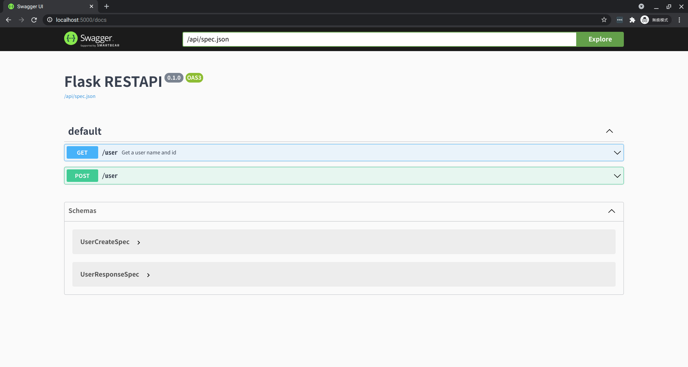

## Initializing Extensions

Initialize flask and api instance

```python hl_lines="3 6"
from flask import Flask

from flask_restapi import Api

app = Flask(__name__)
api = Api(app)
```
## Create sepc model

Create parameter and response for spec model.

```python hl_lines="10 11 14-16 19-21"

from flask import Flask
from pydantic import BaseModel

from flask_restapi import Api, RequestParameters

app = Flask(__name__)
api = Api(app)


class UserGetSpec(BaseModel):
    name: str


class UserCreateSpec(BaseModel):
    name: str
    password: str


class UserResponseSpec(BaseModel):
    id: int
    name: str
```

## Create flask view

Create flask MethodView and add route url to flask.
Although it can be used without MethodView, but is not recommended.

```python hl_lines="25-32 34-40 43"
from flask import Flask
from flask.views import MethodView
from pydantic import BaseModel

from flask_restapi import Api, RequestParameters

app = Flask(__name__)
api = Api(app)


class UserGetSpec(BaseModel):
    name: str


class UserCreateSpec(BaseModel):
    name: str
    password: str


class UserResponseSpec(BaseModel):
    id: int
    name: str


class User(MethodView):
    @api.query(UserGetSpec)
    @api.response(UserResponseSpec)
    def get(self, parameters: RequestParameters):
        """Get a user name and id"""
        user_name = parameters.query.name
        response = UserResponseSpec(id=1, name=user_name)
        return response.dict()

    @api.body(UserCreateSpec)
    @api.response(UserResponseSpec)
    def post(self, parameters: RequestParameters):
        user_name = parameters.body.name
        user_password = parameters.body.password
        response = UserResponseSpec(id=1, name=user_name)
        return response.dict()


app.add_url_rule("/user", view_func=User.as_view("user"))
```

## Interactive API docs 
Swagger ui docs => [http://localhost:5000/docs](http://localhost:5000/docs).  
If you want to access spec.json, you can go to [http://localhost/api/sepc.json](http://localhost/api/sepc.json)

